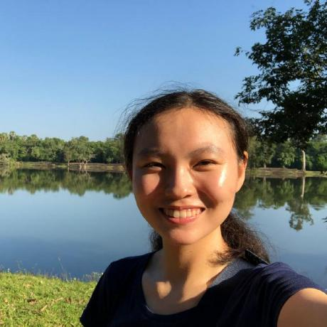

{style="float:left; padding-right: 50px" fig-alt="" width="300"} Hi, I'm Hui Ying!

I am currently in my first post-doc journey at the Singapore Management University (SMU), working on developing a climate risk assessment and a Virtual Reality (VR) communication platform to translate climate projections to policy. Specifically, my research focuses on compounding and cascading risks to the built environment from pluvial flooding, sea-level rise, and urban overheating.

**Current research projects**:

* Pak, H. Y., Sha, A., Valenzuela, V.P.B., Ho, X.T., Chow, W.T.L., & Van Gevelt, T. (Forthcoming). Downward counterfactuals reveal urban vulnerabilities to future climate extremes [manuscript in preparation].

*	Pak, H. Y., Zheng, S., Liao, W., & Chow, W.T.L. (Forthcoming). Flood Risk, Adaptation, and Housing Prices: Evidence from Recurrent Urban Flooding in Singapore [manuscript in preparation].

*	Pak, H. Y., Heng, S.L., Ho, X.T., Ho, B., Yik, S.K., Mandelmilch, M., & Chow, W.T.L.(Forthcoming). Heat Risk Index for the Humid Tropical city of Singapore: Insights on Stakeholder Engagement [manuscript in preparation].

Prior to my postdoctoral research, my Masters and PhD research at Nanyang Technological University (NTU) lie in the nexus of environmental monitoring, remote sensing and machine learning applications. I had the opportunity to work on various interdisciplinary projects in riverine, inland water bodies, and coastal environments in Malaysia and Singapore through close collaborations with academic, agencies, and industry professionals.

Translating theory to practical applications is the principal goal in my professional work, which has encouraged me to create many [open-source projects](https://github.com/pakhuiying) with the community in mind, and applying my [research output](https://scholar.google.com/citations?user=Sphg4YUAAAAJ&hl=en) in industrial domains.

```{r}
#| echo: false
#| output: true
sprintf("CV updated on %10s", Sys.Date())
```
