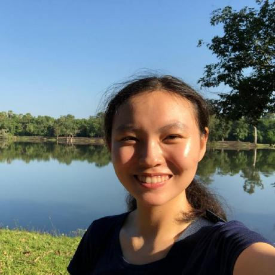

{style="float:left; padding-right: 50px" fig-alt="" width="300"} Hi, I'm Hui Ying!

I am a Research Fellow at Singapore Management University (SMU) and a Visiting Scholar at the Massachusetts Institute of Technology (MIT). My research sits at the confluence of water systems, climate risk, environmental governance, and the translation of evidence into practical decisions.

My work spans water-quality measurement, remote sensing, physical and statistical modelling, and climate-risk assessment. I work across the full chain from field and sensor data to interpretable risk frameworks and policy-relevant insights, with a particular focus on cascading and compounding risks in Asian cities.

### current research

At **SMU**, I develop climate-risk assessments for Singapore using downscaled climate projections, probabilistic pluvial-flood models, and mobility and productivity simulations. These assessments are being operationalised through a VR platform as a communication tool to improve the translation of climate projections into policy. With Cooling Singapore 2.0, I lead the development of a Heat Risk Index for Singapore while engaging government stakeholders to identify policy salience and translate research insights into actionable policies for urban heat planning.

At **MIT**, through the Center for Real Estate and the Department of Urban Studies and Planning, my work focuses on climate risk, sustainable cities, and real-estate responses in Singapore, including the effects of pluvial floods and adaptive infrastructure on housing markets. I am currently exploring research on the environmental governance of data centres and AI infrastructure, particularly cross-border data-centre arrangements between Singapore and Malaysia.

Earlier research at Nanyang Technological University connected environmental monitoring, remote sensing, and machine learning across riverine, inland-water, and coastal environments in Malaysia and Singapore. I also develop [open-source projects](https://github.com/pakhuiying) and share my [research output](https://scholar.google.com/citations?user=Sphg4YUAAAAJ&hl=en) for use beyond academia.

```{r}
#| echo: false
#| output: true
sprintf("CV updated on %10s", Sys.Date())
```


